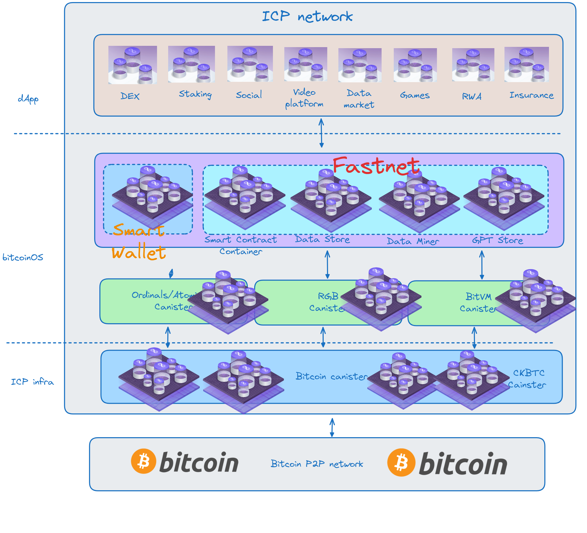

#

[](./LICENSE)
[](http://makeapullrequest.com)

## What's `bitcoinOS`

`bitcoinOS` is an innovative project that combines `Bitcoin` with `AI`. It serves as a `Bitcoin Layer2` asset issuance and management system, incorporating the security of `Bitcoin`, the privacy and smart contract capabilities of `RGB`, and the linear scalability of the `ICP` network. Additionally, it provides individual data sovereignty and data assets, supporting AI innovation platforms with the capability to utilize `GPT` Large Language Models.

`Bitcoin` is a peer-to-peer electronic cash system designed to create a decentralized financial ecosystem, providing individuals with sovereignty over their identity and digital assets. 

`bitcoinOS`, on the other hand, takes `Bitcoin` as its core and adds sovereignty protection for data assets on top of it. `bitcoinOS` is a modular blockchain network that uses Bitcoin L1 as the settlement layer and builds Bitcoin L2: `Fastnet` with `RGB` smart contracts and `ICP` network technology at its core. 

While the `Bitcoin` network primarily focuses on asset platforms and payment applications, `bitcoinOS` expands the scope of Bitcoin's ecosystem and enhances user experience by fully integrating Bitcoin L1 assets and combining them with the ICP network through the `SmartWallet`.

`bitcoinOS` maintains the identity and asset sovereignty of Bitcoin while also increasing support and protection for data sovereignty, enhancing privacy and scalability, thereby facilitating rapid payments and transactions for all Bitcoin assets.

In the era of artificial intelligence, data is considered the most important means of production and factor. Through data sovereignty provided by `bitcoinOS`, legitimate data owners are given the first step of protection. 

Similar to Bitcoin's empowerment of identity and currency, `bitcoinOS's` data empowerment can activate innovation for everyone by utilizing massive data with Large Language Models (`LLMs`) or Large World Models (`LWMs`). This not only promotes the rapid integration of Web2 and Web3 but also drives the widespread adoption of Bitcoin and blockchain technology.

[White paper](./whitepaper/bitcoinOS-whitepaper.pdf)

## Vision
- Bitcoin Assets Hub: bitcoinOS serves as a comprehensive platform for managing Bitcoin native assets, including but not limited to BTC transfers, as well as issuing and trading Ordinals, Atomicals, and RGB assets. As the Bitcoin L2 layer within bitcoinOS, Fastnet facilitates the issuance and trading of RGB assets, providing financial support and fast payments for dApp and ecosystems. bitcoinOS is an excellent hub and funding pool for various Bitcoin assets, catering to a wide range of asset needs.
  
- One-stop Platform: While Bitcoin L1 has successfully established sovereignty over identity and assets, bitcoinOS takes this concept to new heights. Built upon Bitcoin L1 as its core, bitcoinOS utilizes the RGB smart contract protocol on the ICP network to construct Bitcoin L2: Fastnet. Fastnet offers comprehensive Bitcoin smart contract functionality and unlimited scalability, while also strengthening support for data sovereignty, elevating data assets to first-class status. Thanks to the excellent privacy features of RGB and ICP, bitcoinOS not only enables the development of better Web3 applications but also facilitates the development of superior Web2 applications, making it a unified platform for various applications.

- Gateway to AGI: Data assets are considered among the most important digital assets. Just as Bitcoin is digital gold, data is digital oil, and bitcoinOS serves as the catalyst for the digital oil revolution. As the first Bitcoin network to grant data ownership, bitcoinOS is positioned as the gateway to the era of artificial intelligence. In the age of artificial intelligence, data becomes the most crucial factor of production, and possessing bitcoinOS and data assets becomes the ticket for every individual to enter the era of artificial intelligence. You may not have your own large-scale model, but you must have your own unique intelligent entity.

- Foundation for Bitcoin Mass Adoption: As the cornerstone driving the widespread adoption of Bitcoin, bitcoinOS combines the transparency of Bitcoin assets with the versatility of the Fastnet universal network. Fastnet not only facilitates fast payments but also ensures the privacy of content and services, while almost unlimited scalability meets diverse application needs. bitcoinOS positions Bitcoin assets as the universal token of the digital world in the era of artificial intelligence.

- Copilot of Developers & Creators: The runtime environment of bitcoinOS is based on WebAssembly, standing at the forefront of the IT industry's standards and benefiting from the research achievements of the entire industry. The core functionality of bitcoinOS smart contract containers simplifies the complexity of developing smart contracts for developers. They can utilize various programming languages that support WebAssembly, such as Golang, JavaScript, Python, and Rust, for development. Additionally, the built-in dApp Store, Data Store, and GPT Store in bitcoinOS greatly facilitate developers and users in accessing various resources of the Bitcoin ecosystem and innovating using data and AI models.

## Architecture


## Setup
To get started, you might want to explore the project directory structure and the default configuration file. Working with this project in your development environment will not affect any production deployment or identity tokens.

To learn more before you start working with bitcoinOS, see the following documentation available online:

- [Quick Start](https://internetcomputer.org/docs/current/developer-docs/setup/deploy-locally)
- [SDK Developer Tools](https://internetcomputer.org/docs/current/developer-docs/setup/install)
- [Rust Canister Development Guide](https://internetcomputer.org/docs/current/developer-docs/backend/rust/)
- [ic-cdk](https://docs.rs/ic-cdk)
- [ic-cdk-macros](https://docs.rs/ic-cdk-macros)
- [Candid Introduction](https://internetcomputer.org/docs/current/developer-docs/backend/candid/)
- [IC Bitcoin Integration](https://internetcomputer.org/how-it-works/bitcoin-integration/)
- [Bitcoin Integration Wiki](https://wiki.internetcomputer.org/wiki/Bitcoin_Integration)
- [Basic Bitcoin example](https://internetcomputer.org/docs/current/tutorials/developer-journey/level-4/4.3-ckbtc-and-bitcoin/)
- [Bitcoin Canister Source Code](https://github.com/dfinity/bitcoin-canister)

If you want to start working on your project right away, you might want to try the following commands:

```bash
git clone https://github.com/bitcoinOS/bitcoinOS.git
cd bitcoinOS/
dfx help
dfx canister --help
```

## Running the project locally

If you want to test your project locally, you can use the following commands:

```bash
# Clone the `wasm-forge/wasi2ic` project:
git clone https://github.com/wasm-forge/wasi2ic

## Enter the wasi2ic directory and install it
cd wasi2ic
cargo install --path .

# Install just
cargo install just

# Starts the replica, running in the background
# Add --clean if you want to reset the dfx state: dfx start --background --clean
dfx start --background 


# All the just command details are in `justfile`
# Create all canisters
just create_all_canisters

# Compile the project with `wasm-wasi` inside the project folder
just build_wallet

# Translate `wasm32-wasi` target to wasm32-unknown-unknown` under the project directory
just translate_wasm

# Deploy os canister
just deploy_os

# If you want to deploy smartwall by manually, In normal, the smartwallet will be install by os canister
just deploy_wallet
```

Once the job completes, your application will be available at `http://localhost:4943?canisterId={asset_canister_id}`.


### Note on frontend environment variables

If you are hosting frontend code somewhere without using DFX, you may need to make one of the following adjustments to ensure your project does not fetch the root key in production:

- set`DFX_NETWORK` to `ic` if you are using Webpack
- use your own preferred method to replace `process.env.DFX_NETWORK` in the autogenerated declarations
  - Setting `canisters -> {asset_canister_id} -> declarations -> env_override to a string` in `dfx.json` will replace `process.env.DFX_NETWORK` with the string in the autogenerated declarations
- Write your own `createActor` constructor

## Contribute
Contributions welcome! Read the [contribution guidelines](CONTRIBUTING.md) first.

## License

bitcoinOS is primarily distributed under the terms of both the MIT license and the
Apache License (Version 2.0), with portions covered by various BSD-like
licenses.

See [LICENSE-APACHE](LICENSE-APACHE), [LICENSE-MIT](LICENSE-MIT), and
[COPYRIGHT](COPYRIGHT) for details.
