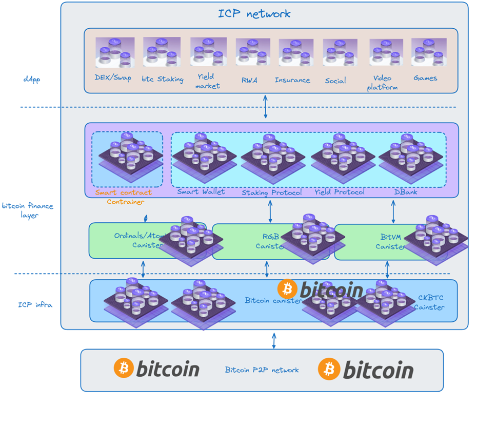

#

[](./LICENSE)
[](http://makeapullrequest.com)

## What's `BifiPal`

`B` Unlocking the DeFi Gaming Paradigm for Bitcoin.

- `Bitcoin Wallet as a Smart Contract`
  - The first Turing-complete native smart contract solution of Bitcoin.
  - An UTXO as an program unit
  - A programmable Bitcoin wallet with PSBT, Miniscript & descriptor as a smart contract
  - A programmable Bitcoin wallet as a Account Abstract

- `Bitcoin Native Finance Platform`
    - Bitcoin as M0 of crypto world
    - Decentralized bank of Bitcoin
    - Bitcoin native staking/loan
    - Bitcoin native atomic swap
    - Bitcoin fast pay with ckBTC
    - Bitcoin derivatives 
    - Bitcoin credits

- `Bitcoin Multi-assets Issuance`
    - Ordinals assets Issuance
    - Runes assets Issuance
    - RGB assets Issuance
    - RWA with Bitcoin Binding
    - Stablecoin based Bitcoin
    - osBTC 1:1 BTC (Principal Token)
    - BOS for Yield Token
  
- `100% on chain with ICP`          
    - BifiPal run on the best cryptography network.
    - Chain-Key & Threshold Cryptography
    - Modular blockchain network
    - Smart contract container
    - WebAssembly
    - Best privacy
    - Data sovereignty

## Architecture


## Setup
To get started, you might want to explore the project directory structure and the default configuration file. Working with this project in your development environment will not affect any production deployment or identity tokens.

To learn more before you start working with BifiPal, see the following documentation available online:

- [Quick Start](https://internetcomputer.org/docs/current/developer-docs/setup/deploy-locally)
- [SDK Developer Tools](https://internetcomputer.org/docs/current/developer-docs/setup/install)
- [Rust Canister Development Guide](https://internetcomputer.org/docs/current/developer-docs/backend/rust/)
- [ic-cdk](https://docs.rs/ic-cdk)
- [ic-cdk-macros](https://docs.rs/ic-cdk-macros)
- [Candid Introduction](https://internetcomputer.org/docs/current/developer-docs/backend/candid/)
- [IC Bitcoin Integration](https://internetcomputer.org/how-it-works/bitcoin-integration/)
- [Bitcoin Integration Wiki](https://wiki.internetcomputer.org/wiki/Bitcoin_Integration)
- [Basic Bitcoin example](https://internetcomputer.org/docs/current/tutorials/developer-journey/level-4/4.3-ckbtc-and-bitcoin/)
- [Bitcoin Canister Source Code](https://github.com/dfinity/bitcoin-canister)

If you want to start working on your project right away, you might want to try the following commands:

```bash
git clone https://github.com/bitcoinOS/bicoinOS.git
cd bitcoinOS/
dfx help
dfx canister --help
```

## Running the project locally

If you want to test your project locally, you can use the following commands:

```bash
# Clone the `wasm-forge/wasi2ic` project:
git clone https://github.com/wasm-forge/wasi2ic

## Enter the wasi2ic directory and install it
cd wasi2ic
cargo install --path .

# Install just
cargo install just

# Starts the replica, running in the background
# Add --clean if you want to reset the dfx state: dfx start --background --clean
dfx start --background   --enable-bitcoin --clean


# All the just command details are in `justfile`
# creat all canisters
just create_all_canisters
# Add wasm32-unknown-unknown target.
rustup target add wasm32-unknown-unknown
# Generate latest did files
# Ensure you env has installed clang.
just generate_did

# Deploy steward canister
just deploy_steward

# Deploy os canister
just deploy_os

# Deploy ic-siwb
just deploy_provider
just  add_provider
# Deploy point canister
just deploy_point

just add_point

#Deploy stake canister
just deploy_stake
just add_stake

# Deploy frontend to canister
just deploy_frontend

# Creat a staking pool
just create_staking_pool

just deploy_ii

# Mint cycles on local network if you need
wallet=$(dfx identity get-wallet)
dfx ledger fabricate-cycles --t 2000 --canister $wallet
dfx wallet balance

# Deposit cycles to os canister if os canister cycles are not enought
dfx canister deposit-cycles 2000000000000 os


# Create staking pool canister by os canister
just create_staking_pool

# If you want to deploy smartwall for test by manually, In normal, the smartwallet will be install by os canister
# just deploy_wallet


  
# Install pnpm
curl -fsSL https://get.pnpm.io/install.sh | sh -
source ~/.bashrc

# install ic-siwb-provider frontend 
cd packages/ic-use-siwb-identity
pnpm install
pnpm build

# frontend
dfx generate
npm i
npm run start
# deploy frontend
npm run build

# if necessary
npm config set registry https://registry.npmmirror.com
pnpm config set registry https://registry.npmmirror.com
sudo npm install -g typescript
pnpm install -D vite
pnpm install @types/react
pnpm install -D @vitejs/plugin-react
pnpm i -D vite-plugin-environment
pnpm i -D dotenv
pnpm i -D sass-embedded

```

Once the job completes, your application will be available at `http://localhost:4943?canisterId={asset_canister_id}`.


### Note on frontend environment variables

If you are hosting frontend code somewhere without using DFX, you may need to make one of the following adjustments to ensure your project does not fetch the root key in production:

- set`DFX_NETWORK` to `ic` if you are using Webpack
- use your own preferred method to replace `process.env.DFX_NETWORK` in the autogenerated declarations
  - Setting `canisters -> {asset_canister_id} -> declarations -> env_override to a string` in `dfx.json` will replace `process.env.DFX_NETWORK` with the string in the autogenerated declarations
- Write your own `createActor` constructor

## Contribute
Contributions welcome! Read the [contribution guidelines](CONTRIBUTING.md) first.

## License

BifiPal is primarily distributed under the terms of both the MIT license and the
Apache License (Version 2.0), with portions covered by various BSD-like
licenses.

See [LICENSE-APACHE](LICENSE-APACHE), [LICENSE-MIT](LICENSE-MIT), and
[COPYRIGHT](COPYRIGHT) for details.
